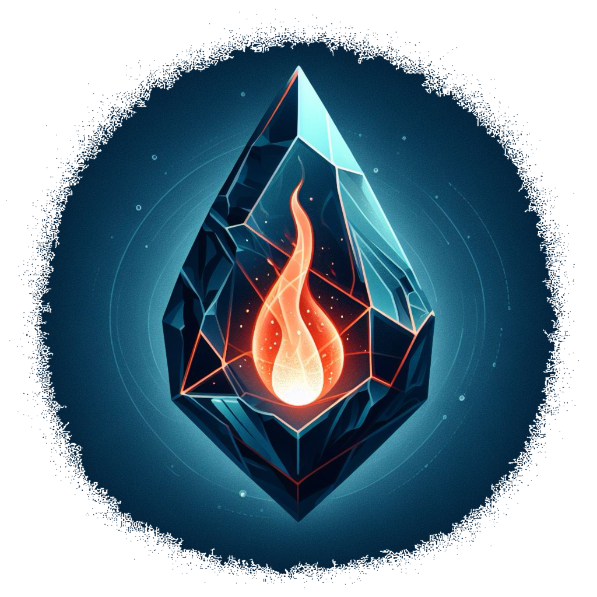

[](https://hex.pm/packages/magma)
[](https://hexdocs.pm/magma/)
[](https://github.com/marcelotto/magma/blob/main/LICENSE.md)

[](https://github.com/marcelotto/magma/actions/workflows/elixir-build-and-test.yml)
[](https://github.com/marcelotto/magma/actions/workflows/elixir-quality-checks.yml)

<br />
<div align="center">
  <a href="https://github.com/marcelotto/magma">
    
  </a>

<h1 align="center">Magma</h1>

  <p align="center">
	An IDE for prompts.
    <br />
    <br />
    <a href="https://hexdocs.pm/magma/01-introduction.html"><strong>Explore the docs »</strong></a>
    <br />
    <br />
    <a href="https://github.com/marcelotto/magma/blob/main/CHANGELOG.md">Changelog</a>
    ·
    <a href="https://github.com/marcelotto/magma/discussions">Forum</a>
    ·
    <a href="https://github.com/marcelotto/magma/issues">Report Bug</a>
    ·
    <a href="https://github.com/marcelotto/magma/issues">Request Feature</a>
  </p>
</div>


## About the Project

Magma is a prompt development environment designed for working with coding agents like Claude Code, Codex, Gemini CLI, OpenCode and similar AI-powered development tools. While these tools are primarily designed for software development, they are increasingly used for a broader range of knowledge work tasks, making Magma useful beyond just coding.

At its core, Magma provides a knowledge base system built on Obsidian-compatible markdown documents that enables rapid composition of prompts through transclusions. This allows you to build reusable prompt libraries where complex prompts are assembled from smaller, well-defined pieces of knowledge.

_Read on in the [User Guide](https://hexdocs.pm/magma/01-introduction.html)_


## Installation

### Homebrew (macOS & Linux)

```bash
brew tap marcelotto/tap
brew install magma
```

### Manual Installation

Download the latest release for your platform from the [Releases page](https://github.com/marcelotto/magma/releases).

Place the binary in your PATH (e.g., `/usr/local/bin/`):

```bash
chmod +x magma_macos_arm
mv magma_macos_arm /usr/local/bin/magma
```

### Verify Installation

```bash
magma version
```

## Quick Start

Initialize a new vault:

```bash
magma init
```

Then open the vault folder in Obsidian. See the [User Guide](https://hexdocs.pm/magma/01-introduction.html) for detailed usage instructions.


## Features

- **Transclusion resolution system** for rapid prompt composition from existing knowledge fragments
- **Session-based workflow** for iterative conversations with coding agents that maintain conversation history
- **Coding agent integration** with support for file reference syntax (`@"path/to/file.md"`)
- **Organized vault structure** with templates for different document types (Prompts and Sessions)
- **Clean separation** of prompts, responses, and notes within Session documents
- **Obsidian integration** with adaptability to many use cases through Obsidian's vast plugin ecosystem


## Known Limitations

See the [open issues](https://github.com/marcelotto/magma/issues) or the [Limitations section](https://hexdocs.pm/magma/07-limitations.html) in the User Guide.


## Contributing

Contributions are what make the open source community such an amazing place to learn, inspire, and create. Any contributions you make are **greatly appreciated**.

If you have a suggestion that would make this better, please fork the repo and create a pull request. See [CONTRIBUTING](CONTRIBUTING.md) for details. You can also simply start a new discussion [here](https://github.com/marcelotto/magma/discussions/categories/ideas)

Don't forget to give the project a star! Thanks!


## Funding

<table style="border: 0;">  
<tr>  
<td><a href="https://nlnet.nl/"></a></td>  
<td>&emsp;</td>  
<td><a href="https://nlnet.nl/assure"></a></td>  
</tr>  
</table>

This project was funded through [NGI Assure](https://nlnet.nl/assure), a fund established by [NLnet](https://nlnet.nl) with financial support from the European Commission's [Next Generation Internet](https://ngi.eu) program.


## License

Distributed under the MIT License. See `LICENSE.md` for more information.
