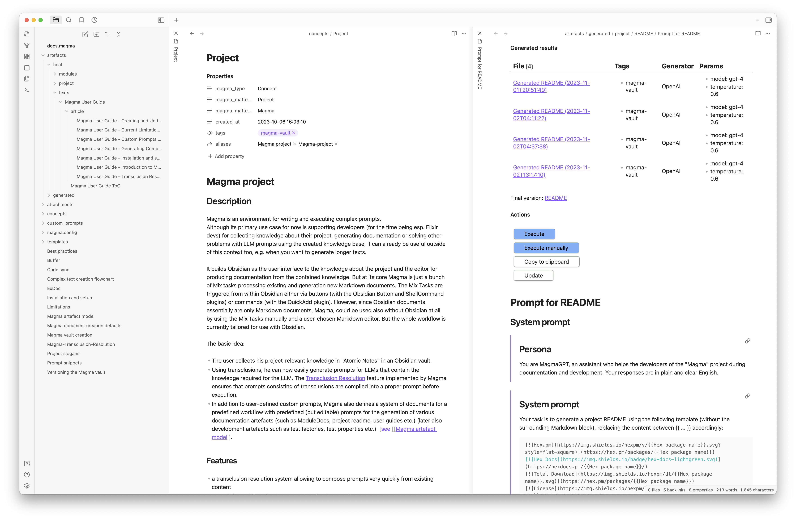

 

  

<h1 align="center">Magma</h3>

  

	An integrated knowledge work environment for open source software projects in Elixir
     
	  with GPT4 as an LLM-based assistant.
     
     
    <a href="https://hexdocs.pm/magma/magma-user-guide-introduction-to-magma-article-section.html"><strong>Explore the docs »</strong></a>
     
     
    <a href="https://github.com/marcelotto/magma/blob/main/CHANGELOG.md">Changelog</a>
    ·
    <a href="https://github.com/marcelotto/magma/discussions">Forum</a>
    ·
    <a href="https://github.com/marcelotto/magma/issues">Report Bug</a>
    ·
    <a href="https://github.com/marcelotto/magma/issues">Request Feature</a>
  

## About the Project

Magma is an environment for writing and executing complex prompts. It is designed primarily to support developers, especially those using Elixir, in collecting project knowledge, generating documentation, and solving problems through LLM prompts. However, it can also be useful outside this context, e.g. for generating longer texts.

_Read on in the [User Guide](https://hexdocs.pm/magma/magma-user-guide-introduction-to-magma-article-section.html)_

## Features

- A transclusion resolution system for quick prompt composition from existing content.
- Extendible workflows with predefined prompts for generating various artefacts such as a project README, module docs, and larger texts.
- Support for automatic prompt execution via the OpenAI API or manual execution via the chat interface of the LLM of your choice (ChatGPT, Bard, Claude etc.).
- Well-organised folder structure for all created files.
- Adaptability to many use cases, thanks to Obsidian's vast plugin ecosystem.

## Roadmap

See the [open issues](https://github.com/marcelotto/magma/issues) or [this page](https://hexdocs.pm/magma/magma-user-guide-current-limitations-and-roadmap-article-section.html) for a list of proposed features and known issues.

## Contributing

Contributions are what make the open source community such an amazing place to learn, inspire, and create. Any contributions you make are **greatly appreciated**.

If you have a suggestion that would make this better, please fork the repo and create a pull request. See [CONTRIBUTING](CONTRIBUTING.md) for details. You can also simply start a new discussion [here](https://github.com/marcelotto/magma/discussions/categories/ideas)

Don't forget to give the project a star! Thanks!

## Contact

Marcel Otto - [@marcelotto (Mastodon)](https://mastodon.social/@marcelotto)  [@marcelotto (X)](https://twitter.com/marcelotto)

## Acknowledgments

A huge thanks to the [NLnet Foundation](https://nlnet.nl/) for funding this project.

## License

Distributed under the MIT License. See `LICENSE.md` for more information.
