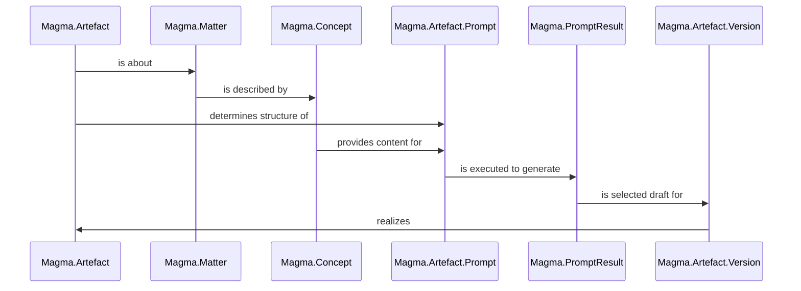
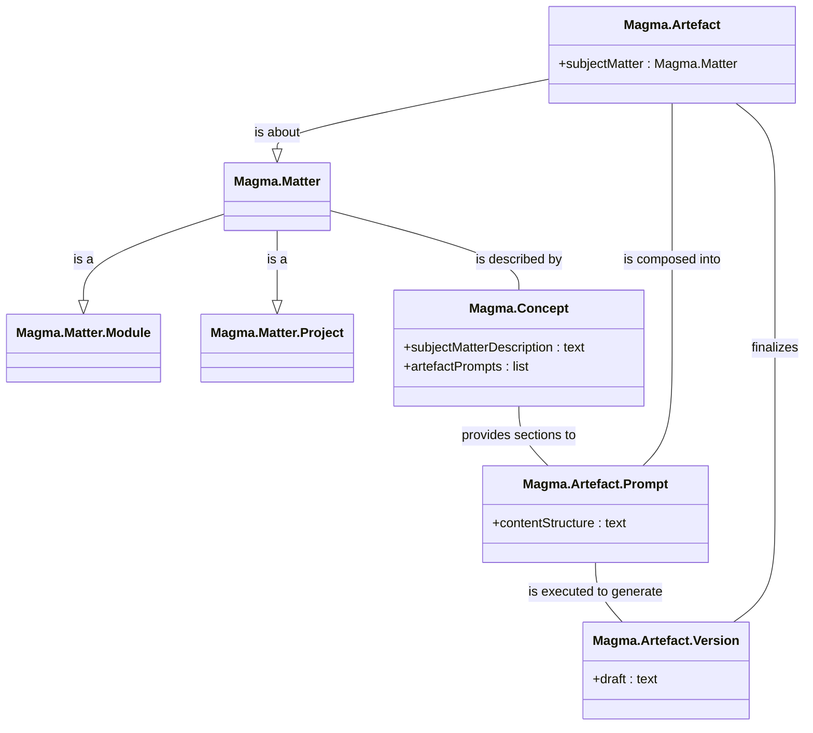

# Magma artefact model

## Description

Artefacts in Magma (`Magma.Artefact`) are things we want to generate. For example 

- documentation artefacts like the moduledocs for the API documentation, user guides, cheatsheets, a project website or README etc.
- but also artefacts for code itself are imaginable (but not yet supported in v0.1), e.g. test factories, properties etc.

A `Magma.Artefact` represents only the idea of such an artefact, i.e. not yet a concrete manifestation. These are represented by a `Magma.Artefact.Version` document which has to be generated as follows:

- A Magma artefact is always about a specific subject matter, which is represented as an instance of a `Magma.Matter` type.
	- e.g. a `Magma.Matter.Module` or `Magma.Matter.Project`
- Such a Magma matter instance is described in a concept document (`Magma.Concept`). Besides this subject matter description, the concept document also includes sections with prompts for the different kinds of artefacts for the kind of subject matter.
	- e.g. in the case of a concept of  a`Magma.Matter.Module`: the prompt for a moduledoc artefact, a cheatsheet, test factories etc.
- In the next step of the artefact generation process the artefact prompt document (`Magma.Artefact.Prompt`) is composed. For this special kind of `Magma.Prompt` document with the generation of a `Magma.Artefact.Version` as its goal, the content structure is determined by its `Magma.Artefact` and is filled with the relevant parts of the concept document and matter-specific parts (e.g. the code of the module in the case of `Magma.Matter.Module`).
- After the execution of the artefact prompt the best prompt result is selected as a draft for the `Magma.Artefact.Version` document, which is finally edited and finalized by the user.

### General Magma artefact creation workflow

1. Write the concept by 
	1. providing a description of the (subject) matter in the "Description" section of the concept document
	2. adding necessary background knowledge in the "Context knowledge" section of the concept document, that helps to understand the description or generate artefacts about this matter
	3. eventually customizing the default prompt of the artefact to be created in the "Artefacts" section of the concept document
2. Review the prompt and eventually refine the concept.
3. Execute the prompt. Eventually multiples times until you're satisfied with the result. Further refine the concept and/or adapt the generation params in this iterative process.
4. Select the best prompt result as a draft for the final version.
5. Edit and finalize the final artefact version.

## Visualizations

### Sequence diagram

### Class diagram

