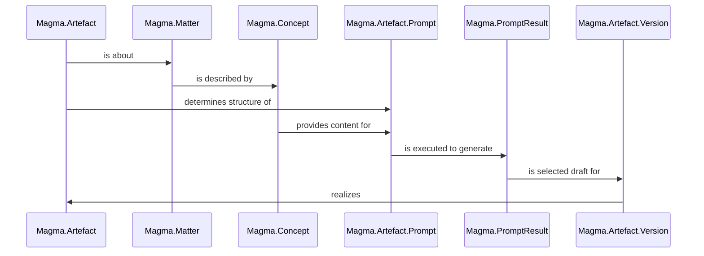

<!-- ExDoc doesn't support YAML frontmatter

---
magma_type: Artefact.Version
magma_artefact: Article
magma_concept: "[[Magma User Guide - Creating and Understanding Magma Artefacts]]"
magma_draft: "[[Generated Magma User Guide - Creating and Understanding Magma Artefacts (article section) (2023-10-31T02:26:01)]]"
created_at: 2023-10-31 02:26:17
tags: [magma-vault]
aliases: []
---

-->

# Creating and Understanding Magma Artefacts

In Magma, we have the ability to generate what we call *artefacts*. These are outputs or products of the Magma environment that are created using predefined workflows and prompts. The basis for this is the Magma artefact model, which we'll introduce in this section. 

Magma artefacts are things we want to generate. For example, these could be documentation artefacts like moduledocs for the API documentation, user guides, cheatsheets, a project website or README. There could also be code artefacts like test factories, properties etc., although these are not yet supported in the current version of Magma.

## Magma Artefact Model

The Magma artefact model is based on the concept of *Matters* and *Artefacts*. A Magma artefact is always about a specific subject matter, which is represented as an instance of a Magma matter type. Such a Magma matter instance is described in a concept document (`Magma.Concept`). The concept document also includes sections with prompts for the different kinds of artefacts for that matter. 

In the next step of the artefact generation process, the artefact prompt document (`Magma.Artefact.Prompt`) is composed. This special kind of Magma prompt document has the goal of generating a concrete version of an artefact in a Magma artefact version document (`Magma.Artefact.Version`). The content structure is determined by the artefact type and is filled with the relevant parts of the concept document and eventually some matter-specific parts, for example, the code of the module in the case of `Magma.Matter.Module` matter type.

After the execution of the artefact prompt, the best prompt result is selected as a draft for the artefact version document, which is finally edited and finalized by the user. 

Here's an illustrative sequence diagram showing the connection between these elements:




In summary, the general process of creating a Magma artefact involves the following steps:

1. **Write the concept**: Provide a description of the (subject) matter in the "Description" section of the concept document. Add necessary background knowledge in the "Context knowledge" section that helps to understand the description or generate artefacts about this matter. Customize the default prompt of the artefact to be created in the "Artefacts" section.
2. **Review the prompt** and refine the concept if necessary.
3. **Execute the prompt**. This can be done multiple times until you're satisfied with the result. Refine the concept and/or adapt the generation parameters in this iterative process.
4. **Select the best prompt result** as a draft for the final version.
5. **Edit and finalize** the final artefact version.

Let's see this workflow in action, by demonstrating the generation of the project README and a moduledoc.

## Generating a Project README

The first step is to write the concept of the project in the concept document. This document was already created during the vault initialization along with a prompt for the README artefact.

### The Concept Document

```markdown
---
magma_type: Concept
magma_matter_type: Project
magma_matter_name: Example
created_at: 2023-10-06 16:03:10
tags: [magma-vault]
aliases: [Example project, Example-project]
---
# Example project

## Description

<!--
What is the Example project about?
-->


# Context knowledge

<!--
This section should include background knowledge needed for the model to create a proper response, i.e. information it does not know either because of the knowledge cut-off date or unpublished knowledge.

Write it down right here in a subsection or use a transclusion. If applicable, specify source information that the model can use to generate a reference in the response.
-->


# Artefacts

## README

- Prompt: [[Prompt for project README]]
- Final version: [[README]]

### Readme prompt task

Generate a README for project 'Example' according to its description and the following information:  
  
Hex package name: app_name
Repo URL: https://github.com/github_username/repo_name  
Documentation URL: https://hexdocs.pm/app_name/
Homepage URL:  
Demo URL:  
Logo path: logo.jpg  
Screenshot path:  
License: MIT License  
Contact: Your Name - [@twitter_handle](https://twitter.com/twitter_handle) - your@email.com  
Acknowledgments:  
  
("n/a" means not applicable and should result in a removal of the respective parts)

```

The concept document has a YAML frontmatter which includes Obsidian properties (`created_at`, `tags`, `aliases`), the `magma_type` property specifying the Magma document type, and two new properties:

- `magma_matter_type`: Specifies the Magma matter type, in this case, `Project`.
- `magma_matter_name`: Specifies the name of the concrete matter, in this case, the name of the project. For matter types, where the matter name is the same as the document name, this property is not needed.

The main body of the concept includes:

#### a) Description of the Matter

The "Description" section of any concept document is crucial as it provides a description of its subject matter, in this case, the project, which will be trancluded as the central part in the request part of the prompt. This description can be written directly into this section or transcluded from other documents. 

> #### info {: .info}
>
> As we saw in the last chapter, the project description is very important, as it is transcluded in the "Context knowledge" section of every custom prompt and every artefact prompt (except for those about the project itself, where it is transcluded more prominently since it's not just context knowledge in this case).

#### b) Context Knowledge

The "Context knowledge" section provides background information that helps to understand the matter and its description. For our project, for example, we could describe its eco-system or some used technologies.

We encountered this section already in the introduction of [Custom prompts](Magma User Guide - Custom Prompts and Prompt Execution (article section).md). However, while in the case of a Custom prompt its content was specified directly in the prompt document, it is now specified in the concept document and transcluded in the prompts of all artefacts of this matter instance.

#### c) Artefacts

The "Artefacts" section includes subsections for all supported artefact types of the respective matter type. These subsections contain links to the respective artefact prompt and artefact version document, and a "Prompt task" section with a default text for the artefact type, which can be customized or extended. 

In the case of our project concept document, the only available artefact type in this first version of Magma is the README artefact. The system prompt for its generation is based on a template, which relies on some information, which should be provided in the given form in this section. If some of the fields do not apply for your project, you should write `n/a`.

### The Prompt Document

After filling the concept document, the artefact prompt document should be reviewed with the transcluded content. Let's look at the artefact prompt document that was generated during the vault initialization.

```markdown
---
magma_type: Artefact.Prompt
magma_artefact: Readme
magma_concept: "[[Project]]"
magma_generation_type: OpenAI
magma_generation_params: {"model":"gpt-4","temperature":0.6}
created_at: 2023-10-24 16:05:35
tags: [magma-vault]
aliases: []
---

**Generated results**

``dataview
TABLE
	tags AS Tags,
	magma_generation_type AS Generator,
	magma_generation_params AS Params
WHERE magma_prompt = [[]]
``

Final version: [[README]]

**Actions**

``button
name Execute
type command
action Shell commands: Execute: magma.prompt.exec
color blue
``
``button
name Execute manually
type command
action Shell commands: Execute: magma.prompt.exec-manual
color blue
``
``button
name Copy to clipboard
type command
action Shell commands: Execute: magma.prompt.copy
color default
``
``button
name Update
type command
action Shell commands: Execute: magma.prompt.update
color default
``

# Prompt for README

## System prompt

You are MagmaGPT, an assistant who helps the developers of the "Example" project during documentation and development. Your responses are in plain and clear English.

Your task is to generate a project README using the following template, replacing the content between {{ ... }} accordingly:

``markdown
[](https://hex.pm/packages/{{Hex package name}})  
[](https://hexdocs.pm/{{Hex package name}}/)  
[](https://hex.pm/packages/{{Hex package name}})  
[]({{Repo URL}}/blob/main/LICENSE.md)  

  
<br />  
<div align="center">  
  <a href="{{Homepage URL or Repo URL}}">  
      
  </a>  
  
<h3 align="center">{{Project name}}</h3>  
  
  <p align="center">  
    {{A project slogan or description of the project with just a few words}}  
    <br />  
    <a href="{{Documentation URL}}"><strong>Explore the docs »</strong></a>  
    <br />  
    <br />  
    <a href="{{Demo URL}}">View Demo</a>  
    ·  
    <a href="{{Repo URL}}/blob/main/CHANGELOG.md">Changelog</a>  
    ·  
    <a href="{{Repo URL}}/issues">Report Bug</a>  
    ·  
    <a href="{{Repo URL}}/issues">Request Feature</a>  
  </p>  
</div>  
  
  
  
## About the Project  
  
  
  
{{A summary of the project}}   
  
  
  
## Getting Started  
  
### Prerequisites  
  
{{Prerequisites of the project}}  
  
  
### Installation  
  
{{Step-by-step instructions on installing and setting the project.}}  
  
  
  
## Usage  
  
{{Useful examples of how the project can be used.}}  
  
_For more examples, please refer to the [Documentation]({{Documentation URL}})_  
  
  
  
## Roadmap  
  
{{Roadmap as a Markdown task list}}  
  
See the [open issues]({{Repo URL}}/issues) for a full list of proposed features (and known issues).  
  
  
  
## Contributing  
  
Contributions are what make the open source community such an amazing place to learn, inspire, and create. Any contributions you make are **greatly appreciated**.  
  
If you have a suggestion that would make this better, please fork the repo and create a pull request.  
See [CONTRIBUTING](CONTRIBUTING.md) for details.  
You can also simply open an issue with the tag "enhancement".  
  
Don't forget to give the project a star! Thanks!  
  
  
  
## Contact  
  
{{Contact}}  
  
  
  
## Acknowledgments  
  
{{Acknowledgments}}  
  
  
  
## License  
  
Distributed under the {{License}}. See `LICENSE.md` for more information.
``


### Context knowledge

The following sections contain background knowledge you need to be aware of, but which should NOT necessarily be covered in your response as it is documented elsewhere. Only mention absolutely necessary facts from it. Use a reference to the source if necessary.

![[Project#Context knowledge]]


## Request

![[Project#Readme prompt task|]]

### Description of the 'Example' project ![[Project#Description|]]
```

Besides to artefact-specific content in the "System prompt" section, you will notice its structure is very similar to the prompt shown in the previous page about "Custom prompts", but has some notable differences:

- In the YAML frontmatter, the properties `magma_artefact` and `magma_concept` have been added, which specify the artefact type and link to the concept document. 
- The **Generated results** now contains a dedicated link to the final artefact version document. 
- The **Actions** buttons now also has an update button, which you can use to regenerate the prompt. Although transcluded content is displayed automatically, it is sometimes necessary to regenerate the prompt (for example when source code, which is included for some artefact prompts, was modified, like for moduledocs), which can be done with this button or the `Mix.Tasks.Magma.Prompt.Update` Mix task .

The artefact prompt can be executed in the same way as described in the "Custom Prompts and Prompt Execution" section of this guide. You may need to execute the prompt multiple times until you're satisfied with the result.

### The Prompt Result Documents

The prompt results now have an additional "Select as draft version" button, which you can use to select the best prompt result as a template for the artefact version. 

Alternatively, you can use the `Mix.Tasks.Magma.Artefact.SelectDraft` Mix task directly:

```sh
$ mix magma.artefact.select_draft "Name of prompt result"
```

> #### warning {: .warning}
>
> If a README already exists and must be overwritten, you must use the Mix task to confirm the overwrite. If you want to use the button, you must manually remove the old version beforehand, as a confirmation is currently not supported in Obsidian.

### The Artefact Version Document

After selecting the best prompt result as a draft, a `README.md` file is created in the project's root directory and filled with the result. A symbolic link to this file is then created in the Magma vault where the artefact version is normally stored (`artefacts/final/project/README/README.md`). This allows the README to be opened and edited in Obsidian. 

As can be seen in this case of a README, artefact version documents are not always proper Magma documents, in the sense that they are properly typed with a `magma_type`, since this isn't possible, when the system consuming the artefact doesn't support YAML frontmatter.

With that, you can now complete the final version of the artefact. 


## Generating module documentation for the API documentation

The process of generating the ModuleDoc for API documentation is quite similar to that of generating a README. The related concept and artefact prompts are created either during the initialization of the vault or by a subsequent code sync (refer to the [Installation and setup](Magma User Guide - Installation and setup (article section).md) page for details). 

Although we're dealing with another matter type here, the concept documents are quite akin to those for the project which we saw in previous README example. The primary differences are:

- The `magma_matter_type` is `Module` instead of `Project`.
- The hints for the content to be written are tailored according to the `Module` matter type.
- The artefacts for the `Module` matter type are different. In the current version of Magma, only the `ModuleDoc` artefact type is available.

The primary goal of the `ModuleDoc` artefact is to generate the content for the `@moduledoc` string in the module's code. In fact, when the final artefact version is generated, you can use the `Magma` module as a replacement for the `@moduledoc` definition:

``` elixir
defmodule Some.Module do
  use Magma
  # will be replaced with a @moduledoc <content of ModuleDoc artefact version document>

  # some code   
end
```

> #### warning {: .warning}
>
> If you decide to include your moduledocs with `use Magma`, be aware that if you're writing a library and your users should be able to use these docs on their machines, e.g. with the `h` helper in IEx you'll have to include the Magma documents with the final moduledocs in your package like this:
> 
> ```elixir
> defp package do  
>   [  
>     # ...
>     files:  ~w[lib priv mix.exs docs.magma/artefacts/final/modules/**/*.md]
>   ]  
  > end  
> ```

However, the artefact prompt also asks for function docs for two reasons:

1.  It's challenging to get the language model to ignore the functions and focus solely on the `@moduledoc`. It tends to describe the functions present in the shown implementation.
2.  Even though Magma doesn't currently offer a similar integration for function docs as it does for `@moduledoc`, they are useful as copy-paste templates.

Here is a detailed look at the prompt for the `ModuleDoc` artefact:


```markdown
# Prompt for ModuleDoc of Some.Example

## System prompt

You are MagmaGPT, an assistant who helps the developers of the "Name of your project" project during documentation and development. Your responses are in plain and clear English.

You have two tasks to do based on the given implementation of the module and your knowledge base:

1. generate the content of the `@doc` strings of the public functions
2. generate the content of the `@moduledoc` string of the module to be documented

Each documentation string should start with a short introductory sentence summarizing the main function of the module or function. Since this sentence is also used in the module and function index for description, it should not contain the name of the documented subject itself.

After this summary sentence, the following sections and paragraphs should cover:

- What's the purpose of this module/function?
- For moduledocs: What are the main function(s) of this module?
- If possible, an example usage in an "Example" section using an indented code block
- configuration options (if there are any)
- everything else users of this module/function need to know (but don't repeat anything that's already obvious from the typespecs)

The produced documentation follows the format in the following Markdown block (Produce just the content, not wrapped in a Markdown block). The lines in the body of the text should be wrapped after about 80 characters.

``markdown
## Function docs

### `function/1`

Summary sentence

Body

## Moduledoc

Summary sentence

Body
``

<!--
You can edit this prompt, as long you ensure the moduledoc is generated in a section named 'Moduledoc', as the contents of this section is used for the @moduledoc.
-->

### Context knowledge

The following sections contain background knowledge you need to be aware of, but which should NOT necessarily be covered in your response as it is documented elsewhere. Only mention absolutely necessary facts from it. Use a reference to the source if necessary.

#### Description of the Magma project ![[Project#Description|]]

#### Peripherally relevant modules

##### `Some` ![[Some#Description|]]

##### `Some.Example.Nested` ![[Some.Example.Nested#Description|]]


## Request

![[Some.Example#ModuleDoc prompt task|]]

### Description of the module `Some.Example` ![[Some.Example#Description|]]

### Module code

This is the code of the module to be documented. Ignore commented out code.

``elixir
defmodule Some.Module do
  use Magma

  # some code	
end
``
```

Besides the project description, the "Context knowledge" section now transcludes the descriptions of all modules beneath the module to be documented  in a subsection "Peripherally relevant modules". For example, for a module `A.B.C`, the descriptions of the modules `A` and `A.B` are transcluded here. Also, all direct submodules are transcluded, i.e. in this case all modules `Some.Example.*`. If you prefer to transclude module descriptions on your own and want to circumvent possible duplicate transclusions, these automatic module context transclusions can be disabled for your application in the `config.exs` with the `auto_module_context` key:

```elixir  
config :magma,    
  auto_module_context: false
```

As can be seen here, the "Request" section in the artefact prompt also includes the actual source code of the module to be documented. Use the "Update" button from the **Actions** in the prologue, to update the prompt after modifications of the code.

The process of executing the artefact prompt and choosing the final artefact is similar to the README artefact. However, that the artefact version can now be kept in a proper artefact version document (with respective YAML frontmatter) at the place where it belongs (in this case `artefacts/final/modules/Some/Module/ModuleDoc of Some.Module.md`) and without the need for a symbolic link.
